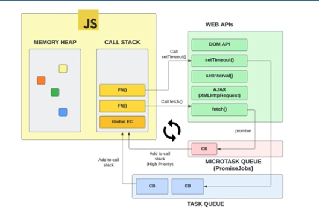

# Asynchrone avec Javascript

Un code **asynchrone** est un code qui ne **bloque pas l'exécution du script**.

**Javascript est un langage synchrone** et ne peut donc pas gérer cet aspect.

Pour ce faire, il va faire appel aux **Web APIs** couplé à un mécanisme dans lequel on trouve **l'Event Loop** et la **Task Queue**.
Les API Web sont ajoutés dans l'objet global pendant la création du contexte d'exécution (Execution Context).



Dans cet exemple, la méthode setTimout est appelée et la fonction de callback est ajoutée en file d'attente (Task Queue). Contrairement à la Call Stack qui est une data structure **LIFO** (Last In First Out), **la Task Queue est de type FIFO** (First In First Out).

Dans le même temps, l'Event Loop va constamment vérifier si la Call Stack est vide et si des méthodes sont présentes dans la Task Queue pour y être ajoutées.

C'est pour cette raison qu'on voit souvent dans du code Javascript ce type de code:

```
setTimout(() => {
  console.log("I'm a hacker !");
}, 0);
```

En écrivant du code dans un setTimout de 0, on s'assure juste que la Call Stack est vide avant d'exécuter notre code.

Concernant les Promises, le fonctionnement est un peu différent puisqu'elles passent par une Microtask Queue qui est prioritaire.
