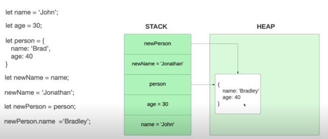
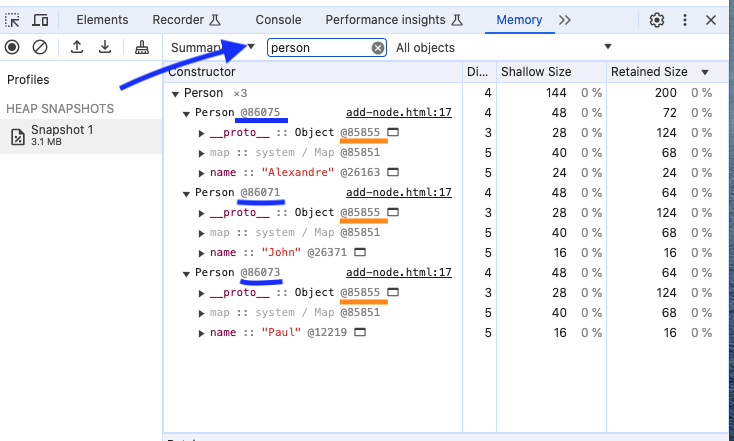

# Comment Javascript Gère la Mémoire

Dans les langages bas niveaux (Low Levels) comme C ou C++, la mémoire est allouée et libérée manuellement. Dans ces langages, si la mémoire n'est pas libérée correctement, celà peut conduire à des fuites mémoire (**Memory Leaks**)

Dans les langages haut niveaux (High Levels) comme Javascript ou Python, la mémoire est allouée automatiquement quand des objets sont créés et libérée quand ces objets ne sont plus utilisé. Des fuites mémoires peuvent arriver quand même (TODO)

C'est ce qu'on appelle **Garbage Collection**.

En Javascript, les variables ne sont pas stockées de la même façon.

Les **Primitive Types** (types primitifs: String, Number, Boolean, Null, Undefined, Symbol) sont **stockés directement dans la "stack"** car leur valeur est fixe.
Quand trop d'élements sont ajoutés dans la stack, après une boucle infinie par exemple, la mémoire est surchargée, c'est ce qu'on appelle **Stack Overflow**

Les **Reference Types** (types "objets" ou "référencés": Array, Function, Object). Cest objets n'ont pas de valeur fixe, il leur faut donc un espace plus large. Il **sont donc stockés dans le Memory Heap** ("tas de mémoire") et on y **accède par référence**, et non directement comme les types primitifs.



Dans cet exemple, on peut voir que, quand on créé une variable de type primitif, le nom et sa valeur sont stockés dans la Stack. Par contre, si on créé un objet, le nom est stocké dans la Stack mais le contenu dans le HEAP. Ensuite, si une nouvelle variable est instanciée à partir de l'objet précédent (newPerson = person), celle-ci pointera vers le même objet.
Celà permet une économie de mémoire mais peut conduire à des comportements inattendu pour les débutants.
Par exemple, si je modifie une propriété de l'objet "person", elle sera aussi modifiée dans l'objet "newPerson" car les deux font référence au même objet dans le Memory Heap.

## Visualiser l'Emprunte Mémoire

On peut visualiser l'emprunte mémoire de l'application en allant dans "Memory", "Heap snapshot" et "Take snapshot"
Voici ce qu'on obtient avec ce code:

```
function Person(name){
    this.name = name;
  }

  const person1 = new Person('John');
  const person2 = new Person('Paul');
  const person3 = new Person('Alexandre');
```



On a bien nos 3 instances de l'objet Person qui pointent au même endroit.
