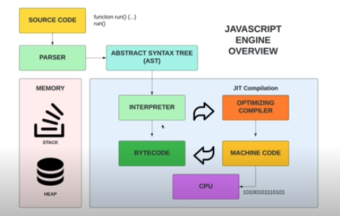
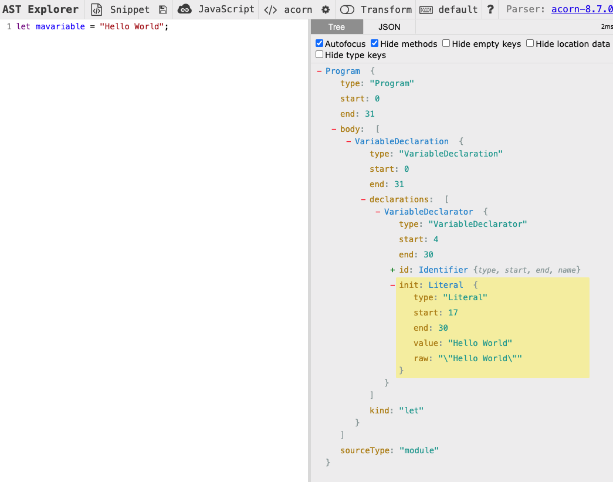

# Moteur Javascript (Javascript Engine)

Le moteur Javascript est un logiciel (codé en C ou C++) qui exécute le code Javascript.
Chaque navigateur possède son propre moteur d'exécution.

Les moteurs Javascript les plus connu sont le **V8 Engine** (Chrome et NodeJS) et **SpiderMonkey** de Firefox.

Le premier moteur JS est le SpiderMonkey créé par le père de Javascript lui même, Brendan Eich.

## Compilé VS Interprété

Le **Javascript** est un **langage interprété**, dans le sens ou le code n'est pas compilé en langage machine directement. Il a donc un temps d'écriture (Write Time) plus rapide mais un temps d'exécution (Run-Time) plus lent contrairement à un langage compilé comme le **C ou C++** qui sont des **langages compilé**. Ils ont donc un temps d'écriture plus long mais un temps d'exécution plus rapide.

Pour prendre une métaphore, si on discute avec une personne étrangère, il est plus long d'apprendre la langue mais plus rapide de parler tandis qu'avec un interprète il est plus lent de parler mais plus rapide de se lancer dans une conversation.

## Comment ça Marche ?

Un exemple avec le moteur V8:

Le parseur (**Parser**) parcours le code source Javascript ligne par ligne pour s'assurer que tout est correcte. Si une erreur est trouvé il s'arrête et retourne l'erreur.

Si tout est correcte, un **Abstract Syntax Tree** (AST) est créé. C'est un arbre de noeud (**Tree of Nodes**) qui représente le code un peu comme le DOM est une représentation du code HTML (voir section Web API).

Ci-dessous un exemple de tree généré (visible sur astexplorer.net):

Ensuite l'interpréteur (**Interpreter**) va récupérer cet AST et le transformer en **Byte Code**, une représentation intermédiaire (IR) d'une partie du code.
Ce Byte Code va ensuite être optimisé via un **Optimizing Compiler** (Just in Time compilation ou **JIT**) pour être ensuite transformé en code machine à la volée (On the Fly).

JIT permet d'avoir un code compilé dynamiquement tandis qu'avec une compilation **AOT (Ahead of Time)**, tout le code est compilé en amont. Cette dernière est utilisé par exemple pour des page web statiques qui utilisent du **Server Side Rendering** qui s'exécute plus vite mais permettent aussi d'avoir une indexation pour les moteurs de recherche.
