# Les Prototypes

Les prototypes en Javascript sont un moyen d'accéder aux propriétés d'un objet à partir d'un autres objet.

Quand les autres langages utilisent des **classes**, Javascript utilise des **prototypes**.

Les prototypes permettent de faire de l'héritage par prototype (**Prototypal Inheritance**).

Javascript est donc un **langage orienté objet**.

Tous les objets ont un objet "prototype" [[Prototype]] qui leur est associé automatiquement à leur création. Cet objet fait référence à un autre objet et créé ainsi une chaine.
Le premier prototype peut être considéré comme une boite à outils livrée avec l'objet.
Une fois l'objet créé, il aura accès aux méthodes de la boite à outils (le prototype).

```
const person {
  name: "john"
}

person.name.toUpperCase() // toUpperCase est une méthode du prototype
```

On peut par exemple vérifier si l'objet possède une propriété grâce à la méthode hasOwnProperty.

`person.hasOwnProperty('name') // true`

## Primitifs

On ne peut pas modifier le prototype des types primitifs et ce pour des questions de performance. Ils sont en effet stockés dans la Call Stack (voir la section Stockage Mémoire).

Pour avoir accès au prototype d'un type string, on peut soit passer par la création avec constructeur:

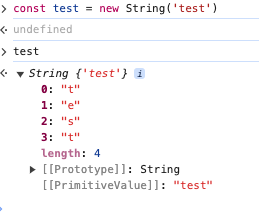

Soit en utilisant une méthode de Object:

```
const test = 'test';
Object.getPrototypeOf(test);
```

## Fonctions

Les fonctions sont des objets particuliers dans le sens où ils héritent de deux objets prototypes

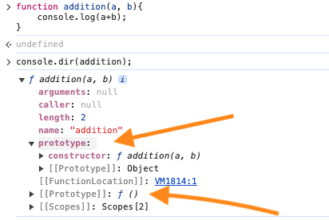

Quand un objet est créé, le moteur Javascript lui ajoute [[Prototype]] automatiquement.
Celui là pointera vers le prototype (pas [[Prototype]] !) de la fonction qui l'a créé (le prototype de la fonction Object() si on ne précise pas).

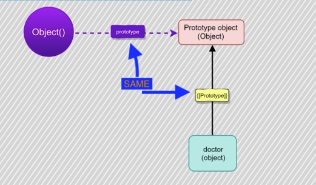

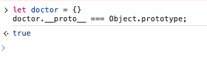

## Classes ES6

Javascript ES6 permet d'utiliser le mot clé class pour ressembler aux autres langages. Mais ce n'est qu'un **Syntactic Sugar** (une extension de la syntaxe pour la rendre plus lisible) et à la fin, on obtient toujours de l'héritage par prototype.

## [[Prototype]]

Quand un objet est créé, Javascript créé un lien vers son prototype ([[Prototype]]) en mémoire. Et celui là sera le prototype Object.
Ce prototype "root" à lui un prototype qui vaut "null".
Notre premier objet est donc créé **à partir du constructeur de Object**.
Plus précisemment, le [[Prototype]] pointe vers le prototype du constructeur de la fonction (pas [[Prototype]], voir la section fonctions).

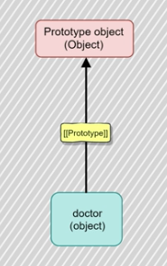

Dans la console:

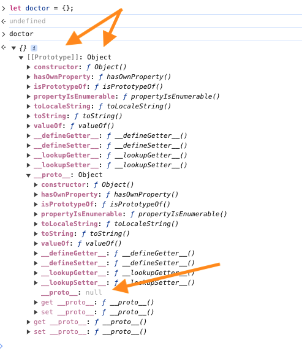

```
let doctor = {};
let doctor = new Object(); // même résultat.
```

On ne peut pas accéder directement à cet objet [[Prototype]] car c'est une propriété interne (**Internal Property** ou **Internal Slot**).
Pour ce faire il faut utiliser:

`doctor.__proto__;`
ou
`Object.getPrototypeOf(doctor);`

## Object

Presque tous les objets sont des instances de Object. Les types primitifs ne sont pas des instances de Object mais Javascript créé un wrapper autour, ce qui permet d'avoir accès au méthodes de Object.

Tous les data types complexes (Array, Function) héritent de Object.prototype.
Les primitifs n'ont pas de prototypes, mais Javascript en interne, créé un wrapper autour de ces types primitifs, ce qui leur donne accès aussi au prototype de Object.

Object est lui même une fonction.
String(), Number() ou Boolean() sont aussi des fonctions qui wrappent ces mêmes types primitifs.

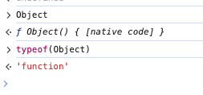

On peut d'ailleur les exécuter pour accéder à leur prototype. Prototype qui pointe vers l'objet global.

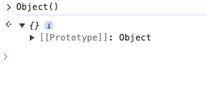

## Le cas de Null

Null est particulier dans le sens où il est considéré comme un type primitif, mais si on vérifie son type, on verra qu'il est de type object mais n'est pas une instance de Object...

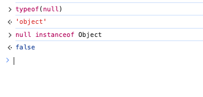

La version courte est qu'il s'agit d'un bug dans Javascript.

La version longue est celle-ci:

Dans la version originale de Javascript, les valeurs étaient stockées en 32 octets.
Les 3 premiers octets représentaient le type (000 pour tous les objets) et les octets restant la valeur.
Comme "null" représente rien ou "void", ses 32 octets sont 0.
Et donc aujourd'hui, quand l'interpréteur Javascript lit les 3 premiers octets (000), il retourne sont type en tant qu'objet.

## Les cas des primitifs

Quand on créé un type string (ou autre primitif), Javascript stocke la variable dans la mémoire Stack (Voir la section stockage mémoire).
Nous n'avons donc pas accès à son prototype car il n'en a pas.

`let name = "John";`

Mais, quand on traite un primitif comme un objet, Javascript va en interne créer un wrapper temporaire (basé sur son type pour exposer uniquement les méthodes nécessaires) et le détruire juste après son utilisation (question de performance).

On peut aussi créer un objet explicitement. Un objet sera créé avec chaque lettre correspondant à une paire clé: valeur.

`let name = new String("John");`

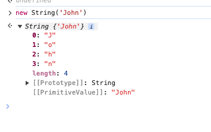

## Prémisses de l'héritage

On peut faire pointer un prototype vers un autre objet:

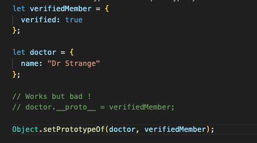

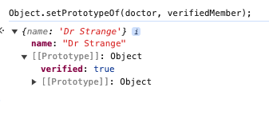

Dans cet exemple, on modifie le prototype d'un objet existant, ce qui n'est pas la manière la plus performante car Javascript doit casse la chaine de prototype existante et en recréer une nouvelle.
Une méthode plus efficace est de faire ça à la création d'un objet:

```
let verifiedMember = {
  verified: true
};

let doctor = Object.create(verifiedMember, {
  name: {
    value: "Dr Strange"
  }
});
```

Mais cette méthode et verbeuse ce qui peut poser problème si l'application prend de l'ampleur.

Nous pouvons aussi créer une chaine de prototype (**Prototype Chain**) de cette manière:

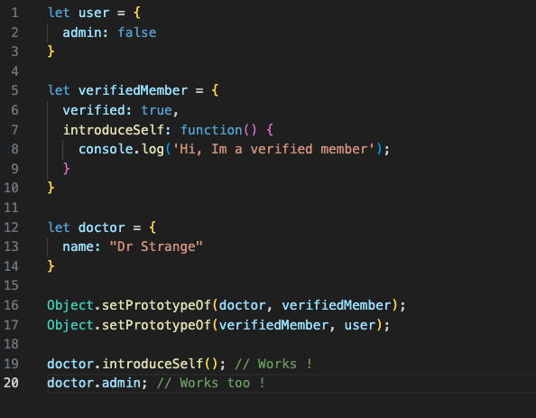

## Shadowing

Si on définie le nom d'une propriété ou d'une méthode qui existe déjà dans un prototype parent, ces dernières seront surchargées (**overriding**). Javascript n'exécutera pas les propriétés ou méthodes parentes.

## Boucler sur un objet

Si on boucle sur un objet avec for...in, nous avons accès aussi aux propriétés hérités (sauf si elles ne sont pas **emunerable** )

```
for (const property in doctor) {
  console.log(property);
}
```

## Enumerable

Toutes les propriétés possèdent un attribut "enumerable" qui permet de savoir si la propriété peut être lue.
Les propriétés déclarés dans un objet sont toutes énumérables par défaut.
D'autres propriétés "haut niveau" comme toString ou hasOwnProperty sont à false.

`Object.toString.propertyIsEmunerable() // false`

Avoir des propriétés non émunérable permet de ne pas itérer dessus.

```
let doctor = {
  name: "Dr Strange"
}

Object.defineProperty(doctor, 'secretSalary', {
  value: 300000,
  enumerable: false
});

console.log(doctor); // {name: "Dr Strange}
```

La propriété "secretSalary" n'est pas visible.

## Boucler sur les objets

Contrairement aux tableaux (Array), les moyens sont assez limités pour boucler sur un objet. On ne peut pas utiliser map() ou forEach().

La principale méthode est for...in comme ci-dessus. L'inconvénient est que toutes les propriétés présentes dans la chaine de prototype seront retournées.

Une des solutions est de vérifier si l'objet possède une propriété.

```
for (const prop in doctor) {
  if (doctor.hasOwnProperty(prop)) {
    console.log(prop);
  }
}
```

Deux méthodes plus moderne ont été introduites avec ES6.
Il s'agit de Object.keys(), Object.values().
ES8 a introduit Object.entries().

```
let keys = Object.keys(doctor); // Return Array
```

## Arrow Functions

Les **Arrow Functions** ne peuvent pas être utilisées comme constructeur avec le mot-clé "new" pour créer un objet car ces fonctions n'ont pas de **[[Construct]] property**.
Cette propriété déclenche le processus de création du "this".

## \_\_PROTO\_\_ (Dunder Proto)

\_\_PROTO\_\_ et [[Prototype]] font référence à la même chose. Dunder proto est simplement une manière d'accéder au [[Prototype]] de l'objet global. C'est un getter/setter pour celui-ci.

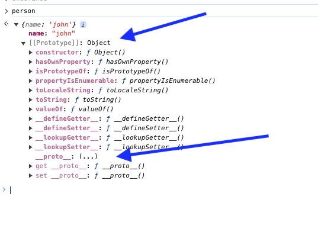

### D'où vient le Dunder Proto

Le \_\_PROTO\_\_ est le même que constructor.prototype.

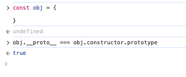

Le Dunder Proto a été inventé par Firefox parce que les développeurs n'avaient pas suffisamment de contrôle sur la manière d'accéder ou modifier un prototype.
L'utilisation de cet objet est **quasi deprecated** et la seule manière "acceptable" de l'utiliser aujourd'hui est à la création d'un objet litéral, quand on veut créer le prototype de l'objet. (Voir annexe B ECMAScript).
Exemple, si on veut créer une instance de Parent:

```
let literalObjectCreation = {
  name: "Test",
  __proto__: Parent.prototype
};
```

Ici, la façon recommandée:

`let obj = Object.create(Parent.prototype);`

Comme on peut le voir ci-dessus, d'autres méthodes ont été introduites: Object.create() ou Object.setPrototypeOf().
Comme il existe d'autres méthodes plus modernes de faire ça, le mieux est de ne plus utiliser Dunder Proto

## Récap de la façon de créer le prototype d'un objet

- Via une fonction constructeur (constructor function)

`new ConstructorFunction();`

- A la création de l'objet

`Object.create(prototype, [props]);`

- Après la création de l'objet

`Object.setPrototypeOf(obj, prototype);`
Il vaut mieux utiliser setPrototypeOf avec des fonctions car il n'est pas possible de setter le prototype d'une fonction à la création. Par contre, avec les objets littéraux, mieux vaut utiliser Object.create car modifier un prototype en cours de route n'est pas conseillé.

- Avec Dunder proto

```
let person = {
  __proto__: prototype
}
```

Cette méthode est deprecated.

## .prototype (Dot Prototype)

Le **.prototype** est une proriété spéciale qu'ont **uniquement les fonctions**.

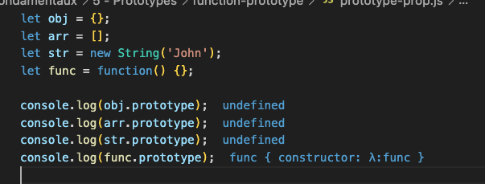;

Son but est de créer l'objet prototype des instances créées à partir de la fonction.

Il y a 2 types de fonctions qui n'ont pas de .prototypes:

- Arrow functions
  Les arrow functions ne peuvent pas être utilisées comme constructor functions. Avec les arrow functions, le "this" fait référence au scope extérieur et donc ne fera pas référence au nouvel objet créé.

- Bound functions
  Les fonctions bindés (Bound Functions) n'ont pas pour but d'être utilisées comme constructor functions. Elles n'ont donc pas de .prototype.
