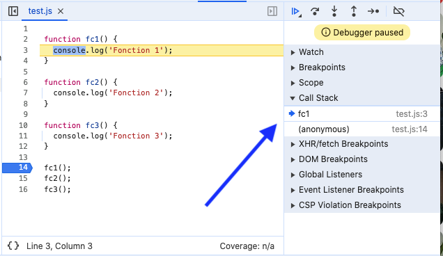
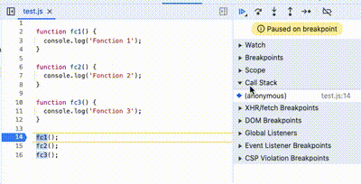
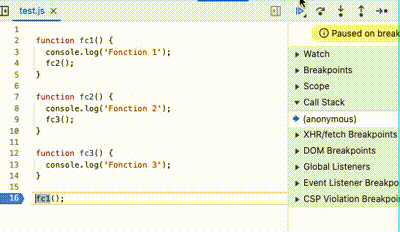
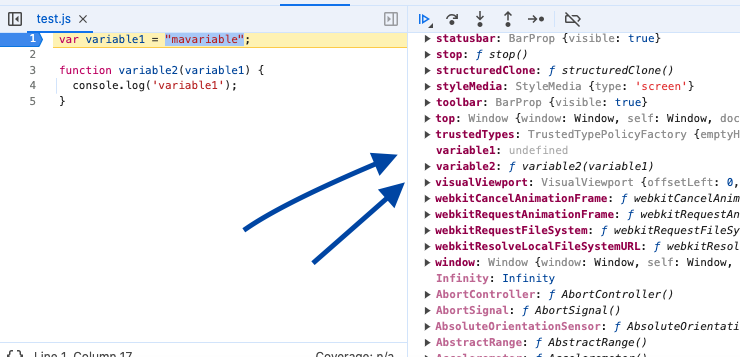
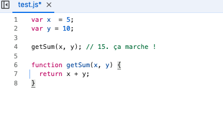

# Contexte d'éxecution et Call Stack (pile d'exécution ou pile d'appel)

## Call Stack

Contrairement à ce que l'on pourrait penser, Javascript est un langage **synchrone**.
Le code est exécuté de façon **linéaire** (single-threaded) grâce à une stucture de données qu'on appelle la **pile d'éxecution** (Call Stack), une "file d'attente" dans laquelle les méthodes sont ajoutées à la suite et retirées une fois terminées.
La stack est de type **LIFO** (last in first out), la dernière méthode arrivée est aussi la première à sortir.

On peut visualiser ce processus en allant dans "sources" de la console du Developer Tool:

On peut voir en ajoutant un breakpoint, que, quand la fonction1 est appelée, elle est ajoutée à la call stack. Ensuite la fonction2 est appelée etc:

Maintenant si j'appelle la fonction2 dans la fonction1 et la fonction3 dans la fonction2, on peut voir que les 3 fonctions s'ajoutent dans la call stack jusqu'à ce que tous les call soient exécutés.

## Execution Context

Il y a plusieurs contextes d'exécution en Javascript.
Le premier contexte d'exécution est celui qui est créé au début de l'exécution du script (fonction anonyme qu'on peut apercevoir dans la call stack en premier).
Il s'agit d'un environnement spécial qui va permettre au code d'être exécuté. Le tout est ajouté dans un **objet WINDOW** (ou global en NodeJS) et un objet **"this"** lui est attaché.

Ensuite un nouveau contexte d'éxecution sera créé chaque fois qu'une méthode sera appelée.

On appelle ça aussi **le Scope**.

Il y a deux étapes qui va créer le contexte d'exécution.
La **phase de création** et la **phase d'exécution**.

#### Phase de création

Pendant la phase de création, le code est parcouru et les variables ainsi que les méthodes sont ajoutées en mémoire dans l'objet global.
Pour les variables, une valeur "undefined" leur est attribué (voir **hoisting**)
En mettant un breakpoint au début du code, on peut voir que la variable est undefined et la déclaration de fonction a été ajoutée en mémoire.

#### Phase d'exécution

Pendant cette phase, le code est exécuté ligne par ligne et un nouveau contexte d'exécution est créé chaque fois qu'une méthode est appelée, répétant les phases précédentes etc...

### Le Hoisting

Une idée reçu concernant le hoisting est que Javascript déplace les déclarations de variables et de fonctions en haut du script, ce qui permet de pouvoir appeler une fonction avant qu'elle ne soit créée.

En réalité, ce sont les 2 phases du contexte d'exécution qui permet celà.

Dans le code ci-dessous, quand getSum() est appelée, la fonction a déjà été créée en mémoire pendant la phase de création:

A noter que le mot clé "let" créé son propre contexte mais est quand même "hoisté" et donc "undefined" pendant la phase de création.
Par contre si on appelle la variable avant sa création, Javascript retournera une erreur. De fait, mieux vaut toujours utiliser le mot clé "let" au lieu de "var".
