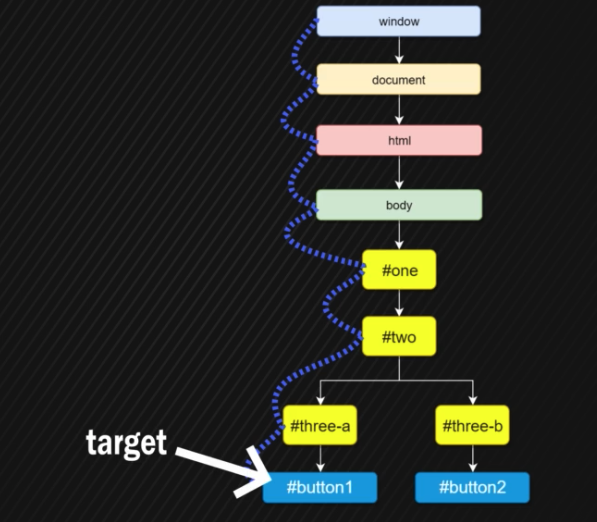

# Les Evènements en Javascript

Les évènements sont des actions qui sont déclenchées chaque fois que l'utilisateur intéragie avec une page web (clique, taper au clavier...).

## Comment créer des évènements ?

Grâce à Javascript.
Les évènements font partie de l'API DOM mais on y intéragie avec JS.
L'API DOM fournie des **Event Listeners** (écouteurs d'évènements) qu'on attache à des éléments du DOM et quand une action est déclenchée, une **fonction de callback** est exécutée en Javascript. On appelle ça un **event handler**.

On peut attacher ces évènements de plusieurs manières:

- Dans le HTML (**inline event listeners**)

`<button onclick="handler()>Clique</button>`

- (**property listeners**)

```
let btn = document.querySelector('button);
btn.onclick= () => {console.log('Hello World')};

```

- Dans le Javascript en récupérant un élement du dom (**event listeners**)

```
let btn = document.querySelector('button);
btn.addEventListener('click', handler);

```

## Question performance ?

Les listeners ne font rien jusqu'à ce qu'un event soit déclenché. Il n y a donc pas d'utilisation de ressources en attendant.

## D'où viennent les évènements ?

Les évènements viennent de l'interface **EventTarget**, dont hérite chaque Node. Il permet aux nodes d'utiliser les évènements grâce à la méthode addEventListener.

# Event Propagation, Capturing, Bubbling

Les évènements ne sont pas déclenchés à partir de l'élément sur lequel on clique, mais à partir du root element (window object).
Les éléments sont ensuite parcouru à travers le DOM et si, sur le chemin, d'autres éléments ont le même évènement, ils seront déclenchés aussi.
C'est l'**Event Propagation**.

Le flux se fait de haut en bas (**Capturing Phase**) pour remonter jusqu'à l'objet Window (**Bubbling Phase**).



Si on clique sur "button1", un évènement clique est déclenché (fired) à partir de l'objet Window et parcours tous les enfants jusqu'au "button1" (target element). C'est la **Capturing Phase** (phase de capture).

Ensuite le DOM remonte chaque élément jusqu'au Window et déclenche chaque évènement sur le chemin. C'est la **Event Bubbling Phase**.

Pour quoi il y a 2 phases ?

#### Un peu d'Histoire

A la base, les développeurs de Netscape et Microsoft n'avaient pas le même modèle de gestion du flux de propagation.

Le modèle de Netscape était l'Event Capturing, qui consiste à notifier le HTML en premier quand on clique sur un bouton. Ensuite on parcours l'arbre d'éléments de haut en bas.

Le modèle de Microsoft était l'inverse. L'Event Bubbling, qui consiste à notifier le bouton en premier et remonter jusqu'au HTML.

Finalement les deux scénarios ont été gardés. C'est pourquoi aujourd'hui le flux de propagation se fait dans les deux sens.

Le modèle par défaut aujourd'hui est celui de Microsoft (Event Bubbling) mais il est possible d'utiliser l'Event Capturing en utilisant le 3ème paramètre de addEventListener, useCapture, qui est à false par défaut.
