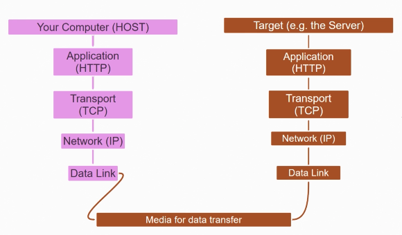

# Navigateur et HTTP

La principale fonctionnalité du navigateur est d'aller chercher une ressource sur le serveur et de l'afficher.

## URI

Pour trouver cette ressource il utilise le **Uniform Resource Identifier** (URI), qui permet de trouver la localisation de cette ressource.

Quand on tape une url, le navigateur va la diviser en 3 parties:

- Le protocol (http, ftp...)

- Le nom du serveur (www.google.com)

Pour trouver le serveur, le navigateur doit communiquer avec un **Name Server**, qui va "traduire" le nom du serveur en adresse IP. Grâce à cette adresse IP, le navigateur va pouvoir communiquer avec le serveur. Le plus souvent sur le port 80.

- La ressource (.html, .txt, .json...)

## Comment voyagent les paquets ?

Le réseau est constitué de 7 couches (layers) qui suit un modèle: le **modèle d'interconnexion des systèmes ouvert** (OSI).
Ce dernier permet de fournir un langage universel d'interconnexion des réseaux informatiques. Plus on remonte des les couches, plus l'abstraction sera élevée.

Pour prendre l'exemple d'une maison, la couche inférieure constituée des fondations doit suivre des règles très strictes, tandis que le choix de la déco est beaucoup plus permissif.

**Les couches du modèle OSI:**

- La couche application (Application Layer)
  Cette couche utilise différents ensemble de règles (protocoles) comme HTTP, FTP, SMTP... C'est avec cette couche que devra intéragir le développeur d'application.
  Dans le cas d'HTTP, une requête HTTP est créée est envoyée à la couche TCP.

- La couche présentation (Presentation Layer)

- La couche session (Session Layer)

- La couche transport (Transport Layer)
  Ici, des informations seront ajoutées comme la destination, le port etc. Les règles utilisées ici sont TCP (Transmission Control Protocol) et UDP (User Datagram Protocol). Les données sont ensuite envoyées à la couche réseau.

- La couche réseau (Network Layer)
  Ici, le protocole IP (Internet Protocol) ajoute ses propres informations aux données reçues. Les informations permettent aux paquets de voyager à travers le réseau.

- La couche de liaison des données (Data Link Layer)
  Cette couche s'assure que les données passe correctement dans la couche physique.

- La couche physique (Physical Layer)
  Une fois que les données sont encodées, la couche physique entre en jeu. Les données sont envoyées physiquement à travers le réseau filaire (ou wifi).
  Une fois les données arrivées à destination, le même processus est effectué dans l'autre sens.

## Protocole HTTP

Le navigateur envoie une requête au serveur, qui va rechercher la ressource et renvoie une réponse avec cette ressource.

Pour ce faire, il utilise l'**Hypertext Transfer Protocol** (HTTP). Un protocole est juste un ensemble de règle.

Le protocole HTTP utilise des paquets, sorte de conteneur qui enveloppe des milliers de données, pour voyager à travers le réseau. De cette manières il est plus facile de transférer l'information et de ne pas surcharger le réseau.

Ce paquet va contenir des informations sur les données transférées (source, destination, taille...) ce qui va permettre d'envoyer les bonnes données au bon endroit.

3 choses à savoir sur HTTP:

- Il est **connectionless**.
  Après avoir fait une requête au serveur, le client (navigateur) ferme la connexion et après avoir reçu une réponse du serveur, il doit réouvrir la connexion.

- Il peut envoyer n'importe quelle donnée du moment que le serveur peut la lire.

- Il est **stateless**
  Le client et serveur possèdent des informations l'un sur l'autre uniquement quand la connexion est ouverte.

## Message HTTP

Un message HTTP contient 3 informations:

- General
  La méthode qui va dire au serveur quoi faire avec ce message (GET, POST...). Le status code en cas de réponse.

- Headers
  Objet qui contient des informations sur le message (type de ressource, langues etc)

- Body
  Le contenu de la requête
