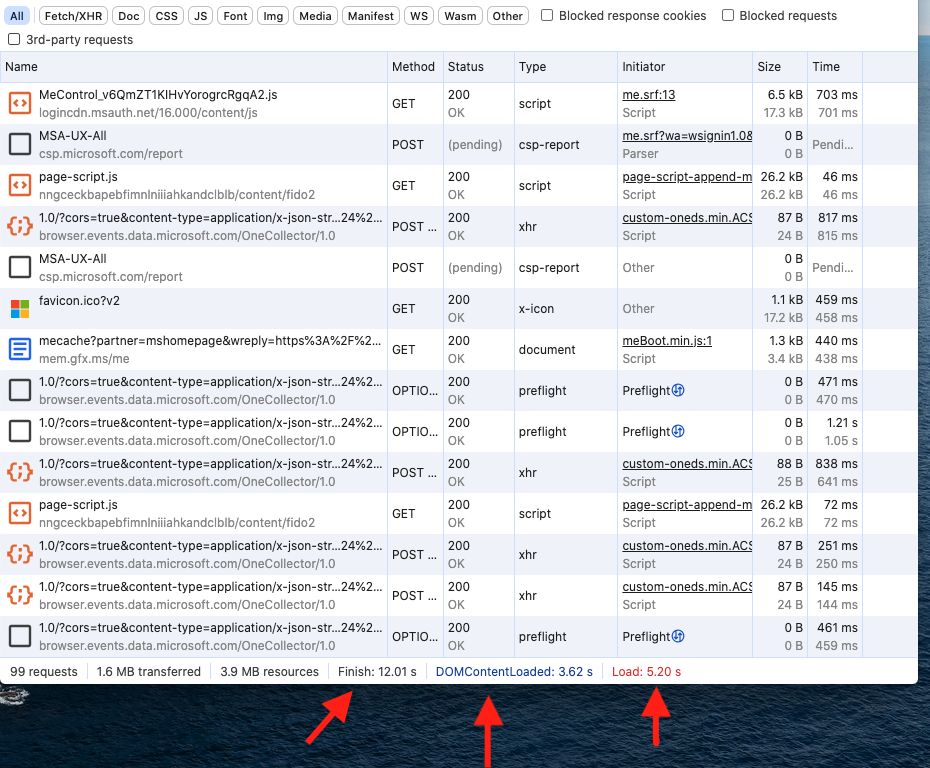

# Rendering Engine

Le processus de rendu (**Rendering Process**) est la façon dont le navigateur affiche une page web.

Le navigateur travaille avec plusieurs environnements:

- Le moteur Javascript (Javascript engine)

- Le moteur de rendu (Rendering Engine)

- Le navigateur lui-même

Le moteur de rendu est un élément du navigateur. Il peut-être différent selon le navigateur (Gecho, Edge, Webkit, Blink...).
Il est responsable de l'affichage du contenu renvoyé par le serveur.

Il y a 4 étapes par lesquelles passe le moteur de rendu:

- La création du **DOM et du CSSOM**

- La création de l'arbre de rendu (**Rendering Tree**)

- La mise en page de l'arbre de rendu (**Layout**)
  Une fois que l'arbre est prêt, le navigateur commence le processus de Layout.
  Il calcule les dimensions de l'endroit où les éléments doivent s'insérer sur la page.

- L'impression des données à l'écran (**Painting**)
  Une fois que le layout est prêt, il faut ajouter les attributs de style (couleurs, margin, animations, etc).

Toutes ces étapes représentent le processus de rendu.

## Le navigateur

Le navigateur passe par 4 étapes:

- La récupération de la ressource sur le serveur (**Fetch**)

- Le traitement de cette ressource (**Process**)

- L'affichage (**Display**)

- Le stockage (**Storage**)

Chaque onglet ouvert sur le navigateur passe par ces 4 étapes.

**Fetch:**
Le navigateur vérifie si un cache local (Local Cache) existe.
Si ce n'est pas le cas, la couche Réseau (Network Layer) doit créer un nouveau paquet HTTP avec le nom de domaine récupéré dans la barre d'adresse.
Une fois que les données sont récupérées, les datas sont fournies au moteur de rendu (Rendering Engine).

**Process:**
La couche réseau a fournie les données au navigateur.
Maintenant, le navigateur doit fournir les autres couches, le moteur de rendu, le moteur Javascript et le UI Backend.

- Rendering Engine: Le moteur de rendu est responsable de l'affichage du contenu. Les données seront affichées en accords avec le **Content-Type** ou **MIME** (HTML, XML, JSON, Images, etc).
  Les moteurs de rendu sont différents en fonction des navigateurs et la plupart sont écrit en C++.
  Une des principales briques du moteur de rendu est le **HTML parser**. Si du HTML a été demandé, il devra lire le HTML et le CSS.
  Une fois que le HTML et CSS a été parsé, le **Render Tree Object** est construit.
  Il va ensuite suivre le processus de "layout" et "paint" pour être affiché à l'écran.

- Javascript Engine: Parse le code Javascript en code Machine. Ils sont écrit pour la plupart aussi en C++.
  Les moteurs Javascript incluent un Memory Heap et une Call Stack (voir section mémoire Javascript).

- UI Backend: Responsable de la création des widgets de base comme les éléments de formulaire etc. Chaque navigateur possède aussi son propre UI Backend. C'est pour cette raison que les éléments UI ne sont pas les mêmes dans navigateur à l'autre.

**Display:**
Cette partie est gérée par le moteur du navigateur. Il fournie une interface haut niveau au Rendering Engine.
Il charge l'URL et aide l'utilisateur à naviguer sur la page (frontend).
Il permet aussi à Javascript d'afficher des éléments comme des alertes ou barres de progression.

**Storage:**
Les navigateurs possède aussi une capacité de stockage pour afficher les pages plus rapidement.
La persistance des données est effectuées par plusieurs API (Local Storage, Session Storage, Cookies, webSQL, IndexedDB, FileSystem, AppCache et Services Workers).

- Local Storage et Session Storage: Sont des paires clé:valeur qui peuvent stocker n'importe quel élément Javascript
- Session Storage: Garde les données en mémoire tant que la session est active.
- Cookie: Collection de paire clé:valeur stocké dans la mémoire du navigateur. Ils naviguent entre le serveur et le navigateur ce qui ne les rend pas très performants. C'est même la méthode la moins performante pour stocker les données dans le navigateur.
  Mais c'est une solution utile concernant la sécurité.

# Critical Rendering Path

Que se passe-t-il quand le HTML est prêt ?
Le moteur de rendu (Rendering Engine) parse le HTML et le convertie en DOM nodes qu'on appelle le **Content Tree** (arbre de contenu).
Dans le même temps, le moteur va aussi parse le style. Ces informations de style et les instructions visuelles du HTML vont être utilisés pour créér un autre arbre: le CSSOM.
Le tout va former le **Render Tree** (arbre de rendu).

L'étape suivant est d'afficher le contenu sur l'écran.

Intervient le **Layout Process**, qui prend chaque node et lui donne les coordonnées exactes de l'endroit où il doit être affiché sur l'écran.

Et enfin, le **Painting**. Le Render Tree est scanné et chaque node est affiché au bon endroit sur l'écran, utilisant la couche UI Backend.

Le processus (Critical Rendering Path), est fluide. Il s'exécute au fur et à mesure que les données sont récupérées depuis le serveur.

## Création du DOM

Pour en savoir plus sur le DOM, voir la section Document Object Model.

Quand le navigateur requête du HTML, il reçoit des bytes. Il doit donc les convertir en une structure compréhensible. C'est la **tokenisation**.
Un token est une partie du HTML qui contient des informations sur chaque balise HTML.
Pour savoir comment il doit convertir les bytes, le navigateur vérifie le charset du document HTML. Par exemple charset-utf-8.
Les tokens sont ensuites convertis en noeuds (Node) qui sont ensuite structurés en arbre (Tree). Cet arbre forme le DOM.

## Analyse du CRP

3 étapes sont importantes pour améliorer les performances. On peut accéder à ces étapes du CRP dans le Developer Tool.


- DCL: Dom Content Loaded Event (Ligne blue)
  Cet évènement indique que le DOM est prêt. A partir de ce moment le Javascript peut-être exécuté.
  On peut accéder à cet évènement:
  `document.addEventListener("DOMContentLoaded), () => {console.log("DOM is ready !")});`

- FCP: First Meaningful Paint
  Vérifier cette étape est importante pour des questions de performance et aussi car Google l'utilise pour le ranking de ses pages.

- L: Onload Event (ligne rouge)
  Cet évènement est déclenché quand toutes les feuilles de styles, images etc sont chargés.

La ligne rouge doit s'exécuter le plus tôt possible pour des questions de performance.

## CSSOM

Pour former le CSSOM, le navigateur passe par les mêmes étapes que pour le DOM.
Le style a aussi besoin d'un arbre car les éléments sont stylisés en cascade. Les enfants héritent du style de leur parent.


Le DOM et CSSOM sont assemblés pour former le Render Tree:


Comme on peut le voir sur l'image, le span est absent de l'arbre car on lui a attribué un display:none.

## Render Blocking Resources

Certaines ressources sont bloquante pour le CRP. C'est le cas du HTML, JS et du CSS.
Cela veut dire que le navigateur ne va traiter aucun contenu jusqu'à ce que le DOM et le CSSOM soient construits. Tout le reste est en pause.
C'est pour cette raison qu'il faut essayer de délivrer le HTML et le CSS le plus rapidement possible.

Le Javascript est aussi bloquant. Si on ajoute une balise "script" entre 2 éléments HTML, le parser HTML sera bloqué jusqu'à ce que le Javascript soit traité.

## Quelles Solutions ?

### CSS

Les Media Queries impactent les performances du CRP, il faut donc les maitriser.
Par ex:

`<link href="protrait.css" rel="stylesheet" media="(min-width: 30em)">`

Si la condition match, le navigateur va bloquer le rendu de la page jusqu'à ce que la feuille de style soit téléchargée et traitée.

Par exemple, la partie la plus importante au chargement d'une page est la partie visible (**The Fold**). Le reste devrait donc être non bloquant.

### Javascript

- **Charger les scripts JS à la fin du document HTML** est une bonne pratique car ça permet au DOM de se construire plus vite et donc arriver plus vite au **First Meaningful Paint**.
  Ca revient à attendre le DOMContentLoaded Event.

- **Async** permet de ne pas bloquer le parsing HTML pendant que le fichier JS est récupéré. Il sera en revanche toujours bloqué pendant la phase d'exécution du Javascript.

`<script async src="app.js"></script>`


- **Defer**, contrairement à Async, garantie que l'ordre des scripts est respecté. Il permet au Javascript d'être exécuté juste avant le DOMContentLoaded.


- **Créer des évènements custom** permet d'avoir plus de contrôle sur l'exécution du Javascript.

```
window.addEventListener('load', () => {
  console.log('Loaded !');
});
```

- **Preload** permet de précharger des ressources. C'est utile pour afficher des ressources dans le fold très rapidement (images, audio, etc).

```
<head>
  <link rel="preload" href="important.js" as="script">
</head>
<body>
  <script src="important.js"></script>
</body>
```

- **Le Speculative Parsing** est maintenant utilisé par les navigateurs. Il permet de télécharger les fichiers en tâche de fond et en parallèle.

## Network



Si on visite la page de Microsoft, on constate qu'il faut 12 secondes pour que toutes les ressources soient fetch mais le DomContentLoaded prend 3.6 secondes.
On peut continuer à scroller pendant que les ressources continuent à arriver.
C'est l'avantage d'utiliser des techniques de preloading comme vu précédemment.

L'important concernant les performances d'une page est le temps que met le navigateur pour être **paint-ready**. C'est à dire, toutes les phases qui précèdent l'affichage des pixels à l'écran.

Les différentes étapes sont les suivantes:

- Le **Queuing** (mise en file d'attente): La requête est mise en file d'attente. Il y a plusieurs raisons pour laquelle une requête est mis en file d'attente:
  - **Retardé par le moteur de rendu** car considéré comme moins important que d'autres ressources comme le CSS ou JS. C'est souvent le cas pour les images.
  - **Un socket TCP peut être indisponible** (voir section HTTP)
  - **Trop de ressources sur un même domaine sont requested**. Par exemple, Chrome impose 6 connexions TCP par host.

Pour soulager le queuing, la solution la plus simple est de supprimer ou "defer" les requêtes qui ne sont pas nécessaires immédiatement.
Il y a aussi le **domain sharding**, qui consiste à créer plusieurs dubdomains pour servir les ressources (ne fonctionne pas avec HTTP2, voir section HTTP).

- Le **Stalled** est similaire au queuing sauf qu'il prend en compte le **proxy negotiation**

- Le **TTFB** (Time To First Byte) est le temps que prend le navigateur à devoir attendre de recevoir les données du serveur après avoir fait une première requête. Il est représenté par une ligne verte dans le Developer Tool network waterfall.
  Il capture le temps d'un aller-retour vers le serveur.
  C'est en général l'étape où il y a le plus de latence dans une requête.

- Le Content Download est le temps qu'il faut pour recevoir tous les octets du serveur après avoir reçu le premier octet (First Byte). Il est représenté par une ligne bleue, juste après la ligne verte. Cette étape est dépendante de la vitesse de connexion.
