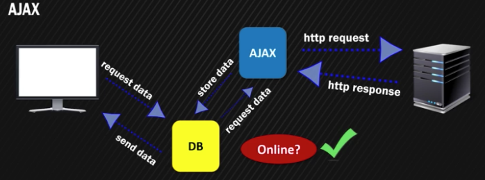

# HTTP, AJAX

## Les Requêtes HTTP Jadis

Le navigateur envoyait une requête HTTP au serveur. Le serveur traitait cette requête et renvoyait une réponse HTTP au navigateur.
Un des principal défaut de ce mécanisme et le rechargement de page. Chaque fois qu'un utilisateur accédait à une page, la page se rechargeait, ce qui peut-être très long et frustrant.

## AJAX

La solution a été de requêter des petites parties de données (chunks) comme HTML, XML ou JSON et permettre au navigateur d'afficher uniquement ces ressources quand il en a besoin.
C'est à ce moment que sont arrivés les APIs comme **XMLHttpRequest** ou **Fetch** qui utilisent **AJAX (Asynchronous Javascript And XML)**.

Maintenant on a donc le navigateur qui envoie une requête à AJAX, qui envoie lui même une requête HTTP au serveur.
Ensuite le serveur renvoie une réponse HTTP à AJAX, qui fourni les données au navigateur.

L'avantage est que tout ce processus s'effectue en tâche de fond, sans avoir à recharger la page.

## Comment utiliser AJAX ?

Pour faire une requête Ajax avec XMLHttpRequest() il y a 3 étapes:

- 1 - Créer la requête

- 2 - Créer une fonction à exécuter quand la requête est terminée

- 3 - Ouvrir la connexion et envoyer la requête

Il y a 4 états (states) concernant la requête (propriété readyState)

- 1 - Aucune connexion a été établie

- 2 - Une connexion est établie

- 3 - Le serveur a reçu la requête HTTP

- 4 - Le serveur traite la requête

- 5 - La réponse en renvoyée

Voir _code/xmlHttpRequest/ajax.html_
